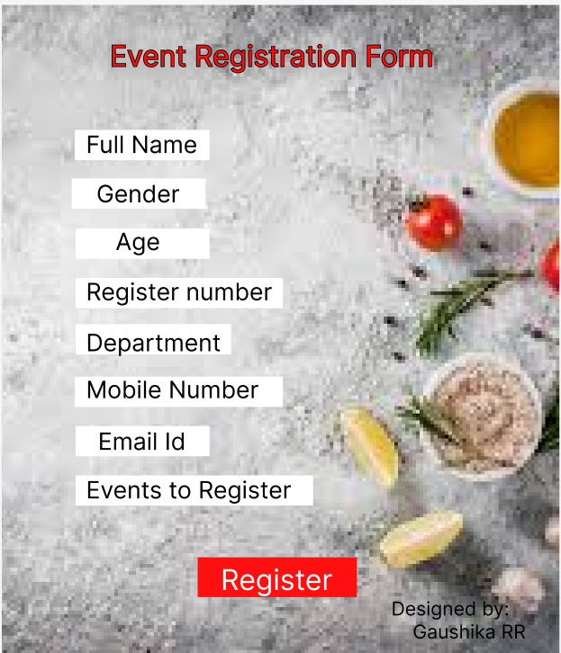

# Ex09 Event Registration Web Application
## Date:6/10/2025

## AIM:
To design, develop and deploy a web application for event registration.

## DESIGN STEPS:

### Step 1:
Create a new frame.

### Step 2:
Select any one preset size of your choice.

### Step 3:
Select the shapes you need.

### Step 4:
Import images as needed.

### Step 5:
Create pages based on your need and link them.

### Step 6:

Validate the HTML and CSS code.

### Step 6:

Publish the website in the given URL.

## DESIGN TOOL:
Figma

## CODE:
```
index.jsx

import React from "react";
import a6c658ed710435c1f15ec4b2df5b15271 from "./a6c658ed710435c1f15ec4b2df5b1527-1.png";
import foodCookingBackgroundIngredientsPreparationVeganDishesVegetablesRootsSpicesMushroomsHerbsOldCuttingBoard1407178021 from "./food-cooking-background-ingredients-preparation-vegan-dishes-vegetables-roots-spices-mushrooms-herbs-old-cutting-board-140717802-1.png";
import rectangle1 from "./rectangle-1.svg";
import screenshot202510062057231 from "./screenshot-2025-10-06-205723-1.png";

export const AndroidMedium = () => {
  return (
    <div className="bg-white w-full min-w-[945px] min-h-[1560px] relative">
      

      

      

      <div className="absolute top-[595px] left-[65px] [text-shadow:0px_4px_10px_#2fe7fc40] [-webkit-text-stroke:1px_#1b1818] [font-family:'Inter-Regular',Helvetica] font-normal text-[#7ff53b] text-8xl tracking-[0] leading-[normal]">
        Cook-Off Carnival
      </div>

      

      <div className="absolute top-[877px] left-[400px] [font-family:'Inter-Regular',Helvetica] font-normal text-[#f90d0d] text-5xl tracking-[0] leading-[normal]">
        login
      </div>

      <div className="top-[1037px] left-[303px] bg-[#32f8f8] absolute w-[304px] h-[84px]" />

      <div className="absolute top-[1050px] left-[360px] [font-family:'Inter-Regular',Helvetica] font-normal text-[#e80b0b] text-5xl tracking-[0] leading-[normal]">
        Register
      </div>

      <div className="absolute top-[1227px] left-[548px] [font-family:'Inter-Regular',Helvetica] font-normal text-black text-5xl tracking-[0] leading-[normal]">
        Designed by:
        <br />
        &nbsp;&nbsp;&nbsp;&nbsp; Gaushika RR
      </div>
    </div>
  );
};

tailwind.config.js

/** @type {import('tailwindcss').Config} */
module.exports = {
  content: ["./src/**/*.{html,js,ts,jsx,tsx}"],
  theme: {
    extend: {},
  },
  plugins: [],
};

tailwind.css

@tailwind components;
@tailwind utilities;

@layer components {
  .all-\[unset\] {
    all: unset;
  }
}

:root {
  --animate-spin: spin 1s linear infinite;
}

.animate-fade-in {
  animation: fade-in 1s var(--animation-delay, 0s) ease forwards;
}

.animate-fade-up {
  animation: fade-up 1s var(--animation-delay, 0s) ease forwards;
}

.animate-marquee {
  animation: marquee var(--duration) infinite linear;
}

.animate-marquee-vertical {
  animation: marquee-vertical var(--duration) linear infinite;
}

.animate-shimmer {
  animation: shimmer 8s infinite;
}

.animate-spin {
  animation: var(--animate-spin);
}

@keyframes spin {
  to {
    transform: rotate(1turn);
  }
}

@keyframes image-glow {
  0% {
    opacity: 0;
    animation-timing-function: cubic-bezier(0.74, 0.25, 0.76, 1);
  }

  10% {
    opacity: 0.7;
    animation-timing-function: cubic-bezier(0.12, 0.01, 0.08, 0.99);
  }

  to {
    opacity: 0.4;
  }
}

@keyframes fade-in {
  0% {
    opacity: 0;
    transform: translateY(-10px);
  }

  to {
    opacity: 1;
    transform: none;
  }
}

@keyframes fade-up {
  0% {
    opacity: 0;
    transform: translateY(20px);
  }

  to {
    opacity: 1;
    transform: none;
  }
}

@keyframes shimmer {
  0%,
  90%,
  to {
    background-position: calc(-100% - var(--shimmer-width)) 0;
  }

  30%,
  60% {
    background-position: calc(100% + var(--shimmer-width)) 0;
  }
}

@keyframes marquee {
  0% {
    transform: translate(0);
  }

  to {
    transform: translateX(calc(-100% - var(--gap)));
  }
}

@keyframes marquee-vertical {
  0% {
    transform: translateY(0);
  }

  to {
    transform: translateY(calc(-100% - var(--gap)));
  }
}


index.jsx

import React from "react";
import foodBackgroundSpicesHerbsUtensil260Nw22543028311 from "./food-background-spices-herbs-utensil-260nw-2254302831-1.png";

export const AndroidMedium = () => {
  return (
    <div className="bg-white w-full min-w-[842px] min-h-[1209px] relative">
      

      <p className="absolute top-[404px] left-[95px] [font-family:'Inter-Regular',Helvetica] font-normal text-black text-5xl tracking-[0] leading-[normal]">
        Quick Bite Challenge
        <br />
        <br />
        No Flame Cooking
        <br />
        <br />
        Healthy Plate Challenge
        <br />
        <br />
        Plating Perfection
        <br />
        <br />
        Mocktail Mix-Off
      </p>

      <div className="absolute top-[118px] left-[81px] w-[582px] [text-shadow:0px_4px_20px_#0e0e0e40] [-webkit-text-stroke:1px_#000000] [font-family:'Inter-Regular',Helvetica] font-normal text-[#fc070b] text-5xl tracking-[0] leading-[normal]">
        Cook-Off Carnival Events
      </div>

      <div className="absolute top-[1012px] left-[535px] [font-family:'Inter-Regular',Helvetica] font-normal text-black text-4xl tracking-[0] leading-[normal]">
        designed by:
        <br />
        &nbsp;&nbsp; Gaushika RR
      </div>
    </div>
  );
};

tailwind.config.js

/** @type {import('tailwindcss').Config} */
module.exports = {
  content: ["./src/**/*.{html,js,ts,jsx,tsx}"],
  theme: {
    extend: {},
  },
  plugins: [],
};


tailwind.css


@tailwind components;
@tailwind utilities;

@layer components {
  .all-\[unset\] {
    all: unset;
  }
}

:root {
  --animate-spin: spin 1s linear infinite;
}

.animate-fade-in {
  animation: fade-in 1s var(--animation-delay, 0s) ease forwards;
}

.animate-fade-up {
  animation: fade-up 1s var(--animation-delay, 0s) ease forwards;
}

.animate-marquee {
  animation: marquee var(--duration) infinite linear;
}

.animate-marquee-vertical {
  animation: marquee-vertical var(--duration) linear infinite;
}

.animate-shimmer {
  animation: shimmer 8s infinite;
}

.animate-spin {
  animation: var(--animate-spin);
}

@keyframes spin {
  to {
    transform: rotate(1turn);
  }
}

@keyframes image-glow {
  0% {
    opacity: 0;
    animation-timing-function: cubic-bezier(0.74, 0.25, 0.76, 1);
  }

  10% {
    opacity: 0.7;
    animation-timing-function: cubic-bezier(0.12, 0.01, 0.08, 0.99);
  }

  to {
    opacity: 0.4;
  }
}

@keyframes fade-in {
  0% {
    opacity: 0;
    transform: translateY(-10px);
  }

  to {
    opacity: 1;
    transform: none;
  }
}

@keyframes fade-up {
  0% {
    opacity: 0;
    transform: translateY(20px);
  }

  to {
    opacity: 1;
    transform: none;
  }
}

@keyframes shimmer {
  0%,
  90%,
  to {
    background-position: calc(-100% - var(--shimmer-width)) 0;
  }

  30%,
  60% {
    background-position: calc(100% + var(--shimmer-width)) 0;
  }
}

@keyframes marquee {
  0% {
    transform: translate(0);
  }

  to {
    transform: translateX(calc(-100% - var(--gap)));
  }
}

@keyframes marquee-vertical {
  0% {
    transform: translateY(0);
  }

  to {
    transform: translateY(calc(-100% - var(--gap)));
  }
}

index.jsx

import React from "react";
import images1 from "./images-1.png";

export const AndroidMedium = () => {
  return (
    <div className="bg-white w-full min-w-[700px] min-h-[840px] relative">
      

      <div className="absolute top-[591px] left-[93px] w-[298px] h-[38px] bg-white" />

      <div className="absolute top-[591px] left-[106px] [font-family:'Inter-Regular',Helvetica] font-normal text-black text-3xl tracking-[0] leading-[normal] whitespace-nowrap">
        Events to Register
      </div>

      <div className="absolute top-[467px] left-[92px] w-[261px] h-[38px] bg-white" />

      <div className="absolute top-[465px] left-[106px] [font-family:'Inter-Regular',Helvetica] font-normal text-black text-3xl tracking-[0] leading-[normal] whitespace-nowrap">
        Mobile Number
      </div>

      <div className="absolute top-[343px] left-[93px] w-[260px] h-[38px] bg-white" />

      <div className="absolute top-[401px] left-[93px] w-[195px] h-[38px] bg-white" />

      <div className="absolute top-[281px] left-[93px] w-[168px] h-[38px] bg-white" />

      <div className="absolute top-[41px] left-[135px] [text-shadow:0px_4px_30px_#00000040] [-webkit-text-stroke:1px_#000000] [font-family:'Inter-Regular',Helvetica] font-normal text-[#ff0c0c] text-4xl tracking-[0] leading-[normal]">
        Event Registration Form
      </div>

      <div className="absolute top-[157px] left-[92px] w-[169px] h-[38px] bg-white" />

      <div className="absolute top-[218px] left-[88px] w-[168px] h-[38px] bg-white" />

      <div className="absolute top-[529px] left-[93px] w-[168px] h-[38px] bg-white" />

      <div className="absolute top-[694px] left-[246px] w-[200px] h-[50px] bg-[#ff0f0f]" />

      <div className="absolute top-[700px] left-[275px] [font-family:'Inter-Regular',Helvetica] font-normal text-white text-4xl tracking-[0] leading-[normal]">
        Register
      </div>

      <div className="absolute top-[157px] left-[106px] [font-family:'Inter-Regular',Helvetica] font-normal text-black text-3xl tracking-[0] leading-[normal] whitespace-nowrap">
        Full Name
      </div>

      <div className="absolute top-[219px] left-[119px] [font-family:'Inter-Regular',Helvetica] font-normal text-black text-3xl tracking-[0] leading-[normal] whitespace-nowrap">
        Gender
      </div>

      <div className="absolute top-[279px] left-[143px] [font-family:'Inter-Regular',Helvetica] font-normal text-black text-3xl tracking-[0] leading-[normal] whitespace-nowrap">
        Age
      </div>

      <div className="absolute top-[342px] left-[106px] [font-family:'Inter-Regular',Helvetica] font-normal text-black text-3xl tracking-[0] leading-[normal] whitespace-nowrap">
        Register number
      </div>

      <div className="absolute top-[406px] left-[106px] w-[203px] [font-family:'Inter-Regular',Helvetica] font-normal text-black text-3xl tracking-[0] leading-[normal]">
        Department
      </div>

      <div className="absolute top-[530px] left-[121px] [font-family:'Inter-Regular',Helvetica] font-normal text-black text-3xl tracking-[0] leading-[normal] whitespace-nowrap">
        Email Id
      </div>

      <div className="absolute top-[744px] left-[489px] [font-family:'Inter-Regular',Helvetica] font-normal text-black text-2xl tracking-[0] leading-[normal]">
        Designed by:
        <br />
        &nbsp;&nbsp;&nbsp;&nbsp;Gaushika RR
      </div>
    </div>
  );
};

tailwind.config.js

/** @type {import('tailwindcss').Config} */
module.exports = {
  content: ["./src/**/*.{html,js,ts,jsx,tsx}"],
  theme: {
    extend: {},
  },
  plugins: [],
};

tailwind.css

@tailwind components;
@tailwind utilities;

@layer components {
  .all-\[unset\] {
    all: unset;
  }
}

:root {
  --animate-spin: spin 1s linear infinite;
}

.animate-fade-in {
  animation: fade-in 1s var(--animation-delay, 0s) ease forwards;
}

.animate-fade-up {
  animation: fade-up 1s var(--animation-delay, 0s) ease forwards;
}

.animate-marquee {
  animation: marquee var(--duration) infinite linear;
}

.animate-marquee-vertical {
  animation: marquee-vertical var(--duration) linear infinite;
}

.animate-shimmer {
  animation: shimmer 8s infinite;
}

.animate-spin {
  animation: var(--animate-spin);
}

@keyframes spin {
  to {
    transform: rotate(1turn);
  }
}

@keyframes image-glow {
  0% {
    opacity: 0;
    animation-timing-function: cubic-bezier(0.74, 0.25, 0.76, 1);
  }

  10% {
    opacity: 0.7;
    animation-timing-function: cubic-bezier(0.12, 0.01, 0.08, 0.99);
  }

  to {
    opacity: 0.4;
  }
}

@keyframes fade-in {
  0% {
    opacity: 0;
    transform: translateY(-10px);
  }

  to {
    opacity: 1;
    transform: none;
  }
}

@keyframes fade-up {
  0% {
    opacity: 0;
    transform: translateY(20px);
  }

  to {
    opacity: 1;
    transform: none;
  }
}

@keyframes shimmer {
  0%,
  90%,
  to {
    background-position: calc(-100% - var(--shimmer-width)) 0;
  }

  30%,
  60% {
    background-position: calc(100% + var(--shimmer-width)) 0;
  }
}

@keyframes marquee {
  0% {
    transform: translate(0);
  }

  to {
    transform: translateX(calc(-100% - var(--gap)));
  }
}

@keyframes marquee-vertical {
  0% {
    transform: translateY(0);
  }

  to {
    transform: translateY(calc(-100% - var(--gap)));
  }
}


```

## OUTPUT:




## RESULT:
The program to design, develop and deploy a web application for event registration is completed successfully.
